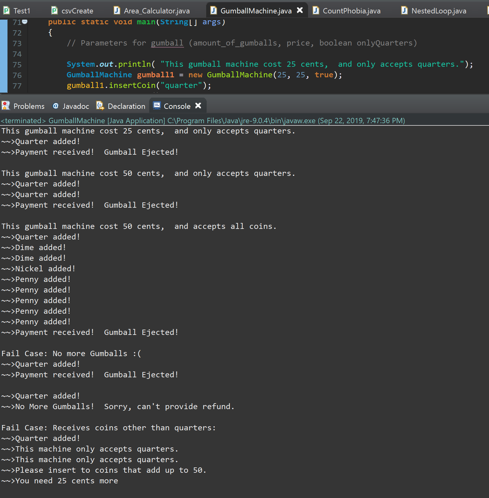

# cmpe202

Code satisfies all requirements. 

Three gumball machines were instantiated (1,2,3) to represent the three gumball machines asked for respectively.

Fail cases are also tested.
1. No more gumballs
2. Wrong coins inputted. 

